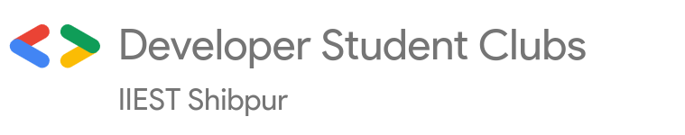

# Google Developer Student Clubs - IIEST Shibpur

## Who are we?

Google Developer Student Clubs (GDSC) are community groups for college and university students interested in Google developer technologies. Students from all undergraduate or graduate programs with an interest in growing as a developer are welcome. By joining a GDSC, students grow their knowledge in a peer-to-peer learning environment and build solutions for local businesses and their community.

## Socials

- Join us at [GDSC Community](https://gdsc.community.dev/indian-institute-of-engineering-science-and-technology/)

- [LinkedIn](https://www.linkedin.com/company/dsc-iiest/)
- [Website](https://dsc-iiest.web.app/)
- [YouTube](https://www.youtube.com/channel/UCkArLcgek88KQMbIu2kmygQ)
- [Twitter](https://twitter.com/dsciiest)
- [Facebook](https://www.facebook.com/dsciiest)
- [Instagram](https://instagram.com/dsciiest)

### Join our [discord](https://discord.gg/e2Yc3dt7JM) to connect with us! 
